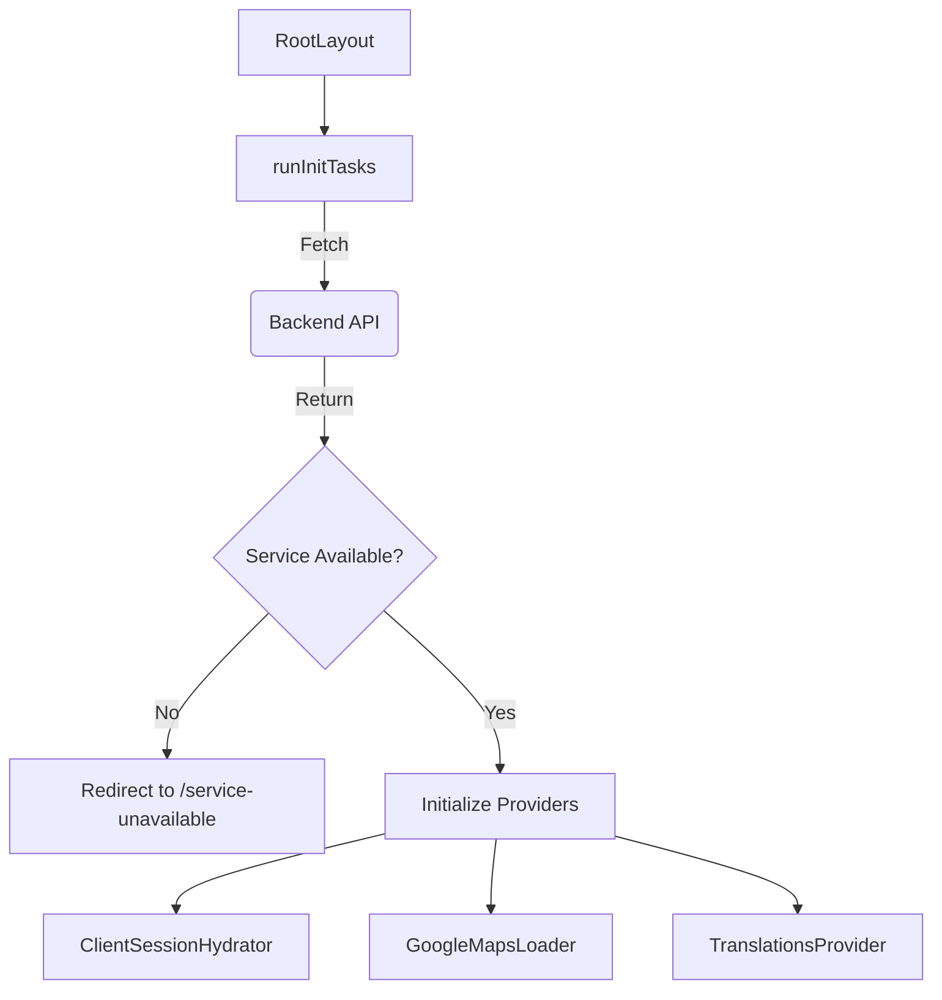

# User Web NextJS Project Documentation

## 1. Project Overview
This project is a **Next.js 14+ Application** built for **Jugnoo Taxi** services. It uses the App Router for routing, **Zustand** for state management, **locales** for internationalization (i18n), and **Tailwind CSS** for styling.

### Tech Stack
- **Framework:** Next.js 14 (App Router)
- **Language:** TypeScript
- **State Management:** Zustand
- **Styling:** Tailwind CSS, Framer Motion (animations)
- **Maps:** Google Maps API (@react-google-maps/api)
- **HTTP Client:** Axios
- **Form Handling:** React Hook Form + Zod
- **I18n:** Next-intl or custom locale handling

---

## 2. Folder Structure (`/src`)

The source code is organized to separate concerns effectively.

| Directory | Purpose |
| :--- | :--- |
| **`app/`** | Contains all route definitions, pages, and layouts. |
| &nbsp;&nbsp;`[locale]/` | Dynamic route segment for handling languages (e.g., `/en`, `/es`). |
| &nbsp;&nbsp;&nbsp;&nbsp;`home/` | The main dashboard/landing page. |
| &nbsp;&nbsp;&nbsp;&nbsp;`layout.tsx` | The root layout that wraps the app with providers & global styles. |
| **`components/`** | Reusable UI building blocks. |
| &nbsp;&nbsp;`booking/` | Components specific to the ride-booking flow (forms, map views). |
| &nbsp;&nbsp;`navbar/` | Navigation bar and menu logic. |
| &nbsp;&nbsp;`shared/` | Generic components (Buttons, Modals, Inputs) used across the app. |
| **`config/`** | Static configuration files. |
| &nbsp;&nbsp;`site.config.ts` | App metadata (title, description). |
| &nbsp;&nbsp;`i18n.config.ts` | Supported locales and default language settings. |
| **`lib/`** | Core libraries and helper functions. |
| &nbsp;&nbsp;`api/` | **Axios instance** (`client.ts`) and **API URL constants** (`endpoints.ts`). |
| &nbsp;&nbsp;`init/` | **Initialization logic** (`initTasks.ts`) run during app startup. |
| &nbsp;&nbsp;`utils/` | General helper functions (formatters, storage wrappers). |
| **`stores/`** | Global state management stores (Zustand). |
| &nbsp;&nbsp;`auth.store.ts` | User authentication state (token, user profile). |
| &nbsp;&nbsp;`booking.store.ts` | Ride booking state (pickup/drop coords, selected vehicle). |

---

## 3. Data Flow & Architecture

### 3.1. Request Lifecycle (The "Middleware" Layer)
**Entry Point:** `src/proxy.ts` (or `middleware.ts`)
1.  **Incoming Request:** A user requests `https://domain.com/`.
2.  **Locale Detection:** The middleware checks the URL.
    *   If no locale is present (e.g., `/`), it redirects to the default locale (e.g., `/en`).
    *   Result: Request becomes `https://domain.com/en`.
3.  **Route Protection:** (Optional) Can check for auth tokens to protect routes like `/profile`.

### 3.2. App Initialization (Server-Side)
**File:** `src/app/[locale]/layout.tsx`
This is the root component that wraps every page. It performs critical setup *before* the UI renders.



1.  **`runInitTasks()`**: Fetches "Operator Params" (business ID, Google Maps keys).
2.  **Hydration**: The data fetched on the server is passed to the client via `<ClientSessionHydrator />` which updates the Zustand stores immediately.

### 3.3. Client-Side State & Interaction
**Core Tool:** Zustand (`src/stores/`)

*   **Auth Store (`auth.store.ts`):**
    *   Holds `authToken`, `userData`, and active `sessionId`.
    *   Persists data to `localStorage` using `persist` middleware.
*   **Booking Store (`booking.store.ts`):**
    *   Manages the complex flow of booking a cab.
    *   State: `pickupLocation`, `dropLocation`, `selectedVehicle`, `rideStatus`.

### 3.4. API Communication Layer
**File:** `src/lib/api/client.ts`
All HTTP requests go through this configured Axios instance.

*   **Base URL:** Loaded from environment variables.
*   **Request Interceptor:**
    *   Automatically attaches the **Authorization Bearer Token**.
    *   Attaches custom headers like `x-jugnoo-session-id`.
*   **Response Interceptor:**
    *   Global error handling.
    *   **Auto-Logout:** If the API returns `401 Unauthorized`, the client automatically clears storage and redirects the user to login.

---

## 4. Key Workflows

### A. Booking a Ride
1.  **User Input:** User enters a location in `RideBookingForm` (`src/components/booking/`).
2.  **Google Maps:** The `GoogleAutocomplete` component fetches coordinates.
3.  **State Update:** `bookingStore.setPickupLocation(coords)` is called.
4.  **API Call:**
    *   `apiClient.post(API_ENDPOINTS.BOOKING.GET_FARE_ESTIMATE, payload)` is triggered.
5.  **UI Update:** The UI subscribes to the store and displays the list of vehicles and prices.

### B. Authentication
1.  **Login:** User enters phone number -> generic login OTP endpoint.
2.  **Verification:** OTP is sent to `API_ENDPOINTS.AUTH.VERIFY_CUSTOMER_OTP`.
3.  **Session Start:** On success, the received **AccessToken** is saved to `auth.store.ts`.
4.  **Navigation:** User is redirected to `/home`.

---

## 5. Environment Variables
Ensure these are set in your `.env` file:
```env
NEXT_PUBLIC_API_URL=https://prod-acl-staging.jugnoo.in
NEXT_PUBLIC_GOOGLE_MAPS_KEY=YourKeyHere
```
